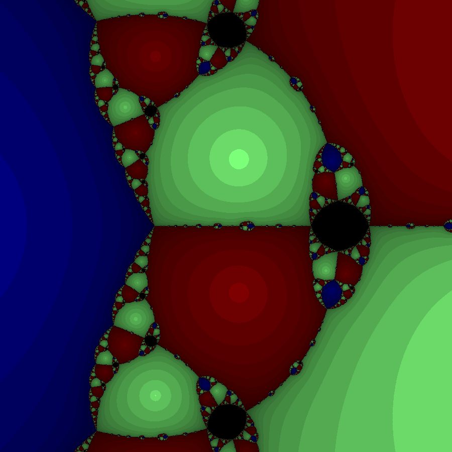
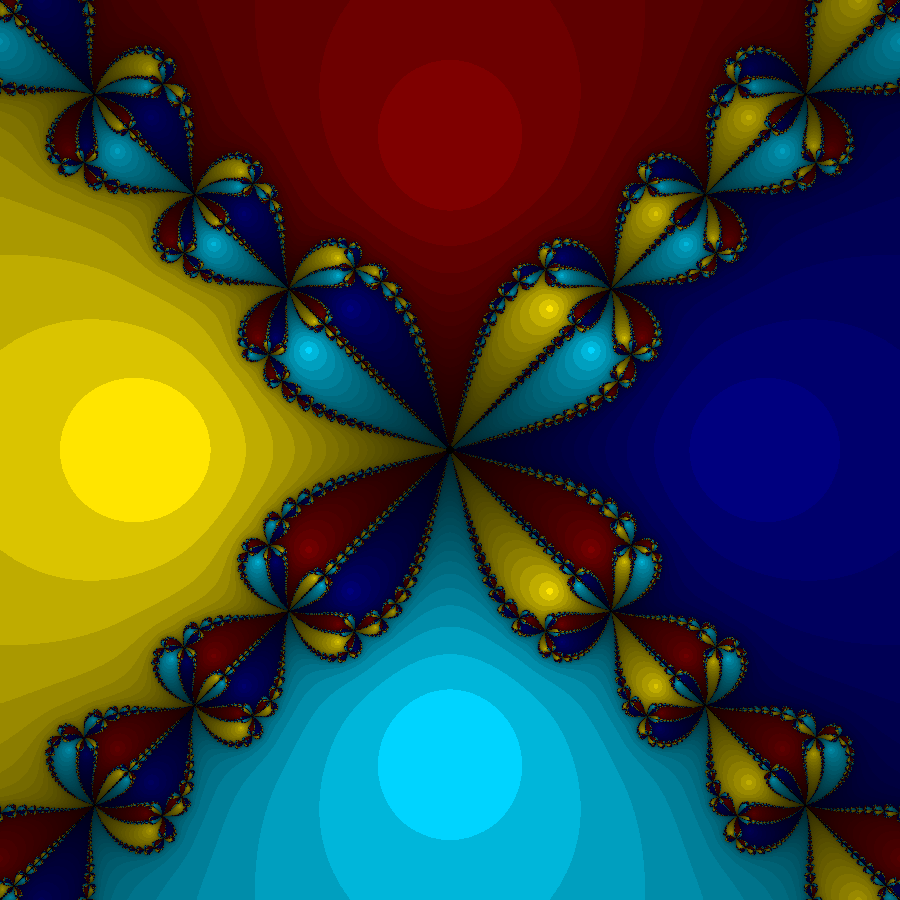
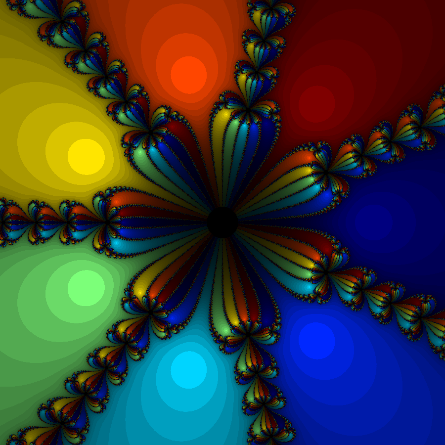
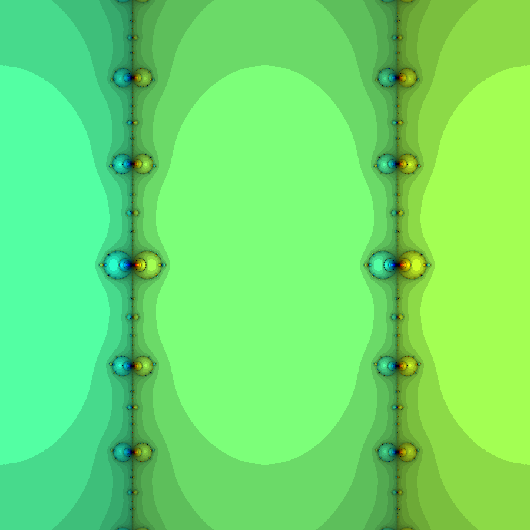

# Newton_Fractals

This is code for visualizing complex functions' roots, also known as Newton Fractals.

## Setup

Run ```tests.py``` after choosing which functions to display and their resolution.

## Settings

You can choose to draw any complex function by specifying (e.g. appending it to) it in the ```fractal_functions``` array in ```lib.py```.
For each function you need to supply the function itself, its derivative, its roots, its defined computable range
in all four directions, and a name for the generated .png file. For hints on how to do that, refer to the already supplied examples.

There are separate tests for each fractal, which makes computing them all in parallel possible, by installing a package like
```pytest-xdist``` (refer to https://www.jetbrains.com/help/pycharm/performing-tests.html#test-mutliprocessing , section **Run tests in parallel**
for more details on how to do that). This is in order to speed-up computation for higher resolutions.

## Sample Outputs








